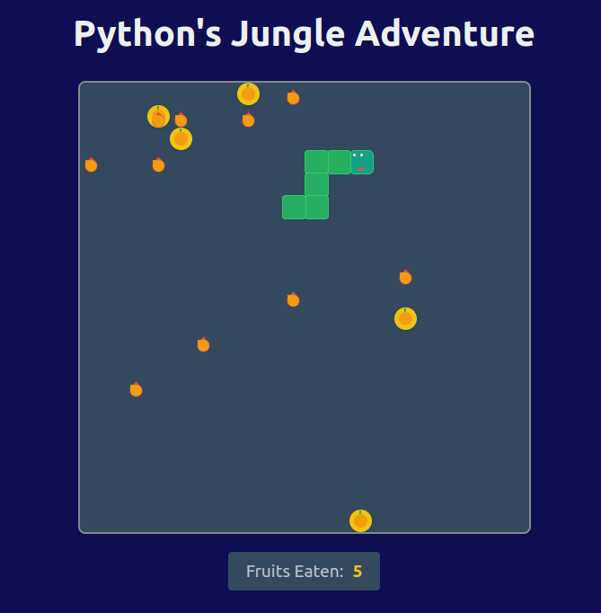

# Python's Jungle Adventure

Python's Jungle Adventure is a modern, classy take on the classic Snake game. Guide your python through a sophisticated environment, collecting exquisite fruits while avoiding dangerous fire hazards.



## Table of Contents

- [Features](#features)
- [Installation](#installation)
- [How to Play](#how-to-play)
- [Game Controls](#game-controls)
- [Customization](#customization)
- [Technologies Used](#technologies-used)
- [Contributing](#contributing)
- [License](#license)

## Features

- Jungle, classy design with a sophisticated color palette
- Customizable game setup: choose the number of fruits and fire hazards
- Smooth, cursor-controlled snake movement
- Dynamic fire hazards that add challenge to the gameplay
- Responsive design that works on various screen sizes

## Installation

To run Python's Jungle Adventure on your local machine, follow these steps:

1. Ensure you have [Node.js](https://nodejs.org/) installed on your computer.
2. Clone this repository to your local machine:
   ```
   git clone https://github.com/yourusername/pythons-jungle-adventure.git
   ```
3. Navigate to the project directory:
   ```
   cd pythons-jungle-adventure
   ```
4. Install the required dependencies:
   ```
   npm install
   ```
5. Start the development server:
   ```
   npm start
   ```
6. Open your web browser and visit `http://localhost:3000` to play the game.

## How to Play

1. When you start the game, you'll be presented with a setup screen.
2. Choose the number of fruits and fire hazards you want in the game.
3. Click "Begin Adventure" to start the game.
4. Guide your python (the snake) using your mouse cursor.
5. Collect fruits to grow longer and increase your score.
6. Avoid colliding with the fire hazards or your own body.
7. The game ends if you collide with a fire hazard or your own body.
8. Try to collect as many fruits as possible to achieve the highest score!

## Game Controls

- Mouse movement: Controls the direction of the snake. The snake will follow the cursor's position.

## Customization

Before starting the game, you can customize:

- Number of fruits: Choose between 1 to 10 fruits.
- Number of fire hazards: Choose between 0 to 10 fire hazards.

Adjust these values to increase or decrease the game's difficulty.

## Technologies Used

- React.js
- CSS3
- HTML5

## Contributing

Contributions to Python's Jungle Adventure are welcome! If you have suggestions for improvements or encounter any issues, please feel free to open an issue or submit a pull request.

1. Fork the repository
2. Create your feature branch (`git checkout -b feature/AmazingFeature`)
3. Commit your changes (`git commit -m 'Add some AmazingFeature'`)
4. Push to the branch (`git push origin feature/AmazingFeature`)
5. Open a Pull Request

## License

This project is licensed under the MIT License - see the [LICENSE.md](LICENSE.md) file for details.

---

Enjoy your adventure with Python's Jungle Adventure! 🐍✨