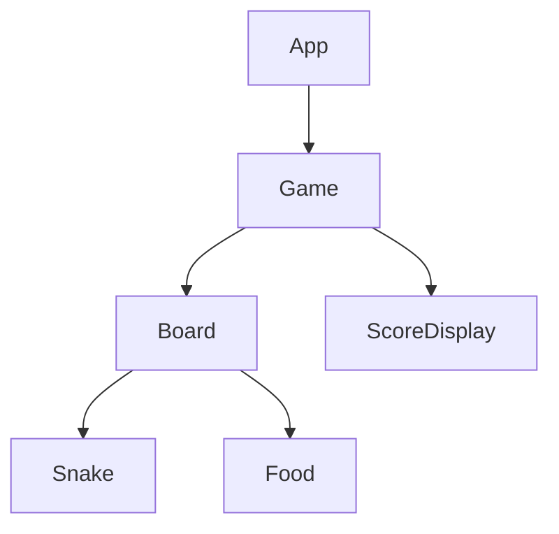

# Snake game.

Step 1: Set up the project

Let's start by creating a new React project using Create React App. Open your terminal and run the following commands:

```bash
npx create-react-app snake-game
cd snake-game
npm start
```

This will create a new React project named "snake-game" and start the development server. You can now open your project in your preferred code editor.

Step 2: Design the game components

For this step, we'll create the basic structure of our game components. We'll start by creating new files for each component in the `src` folder.


```javascript
// src/components/Game.js
import React from 'react';
import Board from './Board';
import ScoreDisplay from './ScoreDisplay';

const Game = () => {
  return (
    <div className="game">
      <Board />
      <ScoreDisplay />
    </div>
  );
};

export default Game;

// src/components/Board.js
import React from 'react';
import Snake from './Snake';
import Food from './Food';

const Board = () => {
  return (
    <div className="board">
      <Snake />
      <Food />
    </div>
  );
};

export default Board;

// src/components/Snake.js
import React from 'react';

const Snake = () => {
  return <div className="snake"></div>;
};

export default Snake;

// src/components/Food.js
import React from 'react';

const Food = () => {
  return <div className="food"></div>;
};

export default Food;

// src/components/ScoreDisplay.js
import React from 'react';

const ScoreDisplay = () => {
  return <div className="score-display">Score: 0</div>;
};

export default ScoreDisplay;

```

Now, let's break down the component structure:

1. `Game`: This is the main component that will contain all other components and manage the game state.
2. `Board`: This component represents the game board and will contain the Snake and Food components.
3. `Snake`: This component will render the snake on the board.
4. `Food`: This component will render the food on the board.
5. `ScoreDisplay`: This component will display the current score.

To use these components, you'll need to update your `src/App.js` file:

```jsx
import React from 'react';
import Game from './components/Game';
import './App.css';

function App() {
  return (
    <div className="App">
      <Game />
    </div>
  );
}

export default App;
```

This structure provides a solid foundation for your game. Each component is currently a simple placeholder, but we'll add more functionality to them as we progress through the remaining steps.

Let's create component hierarchy diagram using Mermaid to visualize the structure of our Snake game components.



This diagram shows the hierarchical structure of our Snake game components:

1. At the top, we have the `App` component, which is the entry point of our React application.
2. The `Game` component is a child of `App` and will manage the overall game state and logic.
3. `Board` and `ScoreDisplay` are children of the `Game` component:
   - `Board` represents the game area where the action takes place.
   - `ScoreDisplay` shows the player's current score.
4. The `Board` component contains two child components:
   - `Snake` represents the player-controlled snake.
   - `Food` represents the items the snake will try to eat.

This hierarchy reflects the component structure we created in the previous step. It provides a clear visual representation of how our components are organized and how they relate to each other.

As we continue to develop the game, we may add more components or adjust this hierarchy, but this structure gives us a solid starting point for building our Snake game.
